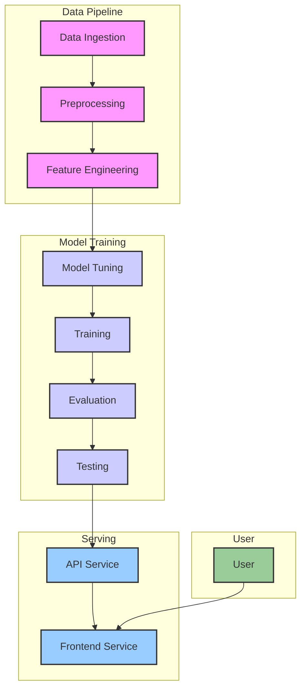

# MusicGen Documentation

This document provides a detailed explanation of the MusicGen project, including its architecture, data pipeline, and how to use it.

## Architecture

The MusicGen project is an end-to-end MIDI music generation system. It is composed of a data processing and model training pipeline, and a serving component to expose the model's generation capabilities through a web interface.

The architecture can be visualized as follows:



### Components

*   **Data Pipeline**: Responsible for downloading, preprocessing, and transforming MIDI data into a format suitable for model training.
*   **Model Training**: A sequence of steps to tune, train, and evaluate the music generation model.
*   **Serving**: Consists of a backend API to serve the trained model and a frontend web application for user interaction.
*   **User**: Interacts with the system through the web interface.

## Pipeline

The project's functionality is organized into a pipeline, executed via `make` commands.

### 1. Ingestion

*   **Command**: `make ingest`
*   **Script**: `src/cli/ingest.py` -> `src/data/download.py`
*   **Description**: This step downloads MIDI datasets from sources defined in `data/sources.yaml`. It supports downloading from URLs and Kaggle. The downloaded files are stored in `data/external/_downloads`, extracted to `data/external/<dataset_name>`, and the MIDI files are copied to `data/raw/<dataset_name>`.

### 2. Preprocessing

*   **Command**: `make preprocess`
*   **Script**: `src/cli/featurize.py --stage preprocess` -> `src/data/preprocess.py`
*   **Description**: This step scans the raw MIDI files in `data/raw`. For each MIDI file, it extracts metadata such as the instruments used, the number of tracks, and the number of notes. The results are saved to `data/interim/scan.csv`.

### 3. Feature Engineering

*   **Command**: `make fe`
*   **Script**: `src/cli/featurize.py --stage features` -> `src/data/feature_engineering.py`
*   **Description**: This step converts each MIDI file listed in `data/interim/scan.csv` into a sequence of tokens. The tokenization process is a naive implementation that represents musical events (instrument, time, velocity, note on) as tokens. The resulting token sequences are saved as NumPy arrays (`.npy` files) in `data/processed/tokens`.

### 4. Tuning

*   **Command**: `make tune`
*   **Script**: `src/cli/tune.py` -> `src/tuning/grid_search.py`
*   **Description**: This step performs hyperparameter tuning for the model. It uses a simple grid search to find the best combination of learning rate, batch size, and sequence length.

### 5. Training

*   **Command**: `make train`
*   **Script**: `src/cli/train.py` -> `src/models/train.py`
*   **Description**: This step trains the `MusicLSTM` model on the tokenized data from `data/processed/tokens`. The trained model is saved to `artifacts/models/music_lstm.pt`.

### 6. Evaluation

*   **Command**: `make evaluate`
*   **Script**: `src/cli/evaluate.py` -> `src/models/evaluate.py`
*   **Description**: This is a placeholder step to evaluate the trained model. In its current implementation, it prints the number of model parameters.

### 7. Testing

*   **Command**: `make test`
*   **Script**: `src/cli/test.py` -> `src/models/test.py`
*   **Description**: This is a placeholder for a model testing step.

## Serving

The serving component consists of two FastAPI services that are orchestrated using `docker-compose`.

*   **Command**: `make up`

### API Service

*   **File**: `services/api/app.py`
*   **Port**: 8000
*   **Description**: This service exposes the music generation model through a REST API.
*   **Endpoints**:
    *   `GET /health`: Returns the status of the service.
    *   `POST /generate`: Generates a MIDI file based on the provided instruments and other parameters.

### Frontend Service

*   **File**: `services/front/main.py`
*   **Port**: 8080
*   **Description**: This service provides a simple web interface for interacting with the music generation model. It sends requests to the API service and allows the user to download the generated MIDI file.

## How to Use

1.  **Build Docker Containers**:
    ```bash
    make docker-build
    ```
2.  **Run the Data Pipeline and Model Training**:
    ```bash
    make ingest
    make preprocess
    make fe
    make tune
    make train
    make evaluate
    make test
    ```
3.  **Start the Services**:
    ```bash
    make up
    ```
4.  **Access the Web Interface**:
    Open your browser and navigate to `http://localhost:8080`.
